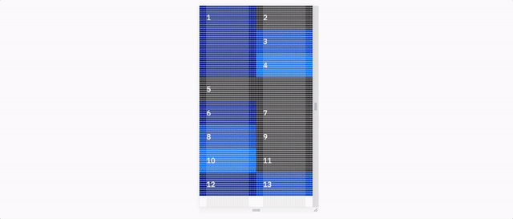

# IBM Grid

The Sketch file and a flexbox code implementation of the IBM Grid.

---

**Warning:** IBM Grid is still in development and being carefully implemented in real cases where we can look for any difficulties. Look out for a stable v1.0.0 release by October 16th.

---

### [IBM Grid Checker](https://github.ibm.com/duo/grid-checker)

Check that any webpage follows the IBM Grid with this Chrome and Firefox extension. This extremely helpful to developers as they code and designers as they review work.

### Examples

We want to show off many examples of what IBM Grid is capable of. Check out the examples below and learn at the bottom of this document how to provide a new example:
-  [Capabilities](https://github.ibm.com/pages/duo/grid/examples/capabilities/index.html) ([Source](./docs/capabilities.html))
-  [Dev Tutorial](https://github.ibm.com/pages/duo/grid/examples/index.html) ([Source](./docs/index.html))

# Design

### [IBM Grid Sketch File]()

Use these artboards in your Sketch files to accomplish a design at each breakpoint your developer will be working with. Right click and select `Save link as` to save the file.

### Do I have to use this grid design?
For an experience to represent IBM, it should match the specs of the [Sketch file](h) and [IBM Grid Checker]().

### Why does IBM have a grid for all digital experiences?

This is a part of an effort to make sure a user feels like they are working with the same company across any variety of experiences.

# Code

The IBM Grid code provides the following benefits:

- Specify an col's width and existence at different breakpoints
- Group cols together to form any combination of nested rows and columns
- Remove the default padding when not needed for media and then reapply it on any child desired
- Stretch the background (aka bleed) of an col on our large breakpoint when desired

### [Developer Tutorial]()

Use this walkthrough to learn the foundational aspects of coding with the IBM Grid. Recommended for all first-time users.

### Do I have to use this grid code?

You do not need to use the code in this repo. We understand that there are many ways to accomplish the same goal in code. The flexbox code provided here is to help anyone who wants it.

### Where is the [CSS Grid Spec](https://developer.mozilla.org/en-US/docs/Web/CSS/CSS_Grid_Layout) implementation?

We want it also. However, many of our experiences support IE11 at the moment. If your experience does not need to support IE11 or you do not need the [missing specs in IE11](https://rachelandrew.co.uk/archives/2016/11/26/should-i-try-to-use-the-ie-implementation-of-css-grid-layout/), feel free to use CSS Grid.

If you would like to help develop a resource to implement this grid using CSS Grid, all contributions are welcome!

## Classname Reference

| Classname                     | Purpose                                                                                                                                             |
|-------------------------------|-----------------------------------------------------------------------------------------------------------------------------------------------------|
| `.ibm`                        | Container div of the grid                                                                                                                           |
| `.ibm-col-sm-[0-4]`           | Set the width out of two columns for an item in the grid starting at 0px screen width                                                               |
| `.ibm-col-md-[0-8]`           | Set the width out of four columns for an item in the grid starting at 640px screen width                                                            |
| `.ibm-col-lg-[0-16]`           | Set the width out of two columns for an item in the grid starting at 1056px screen width                                                            |
| `.ibm-col-[sm, md, lg]-0-only`  | Do not display an item for a specific breakpoint                                                                                                    |
| `.ibm-col-group`              | Turn an item into a group of items for sub-rows and sub-columns                                                                                     |
| `.ibm-col-tall`               | Double the vertical padding of an item                                                                                                              |
| `.ibm-col-full`               | Undo all padding of an item                                                                                                                         |
| `.ibm-col-full_padding`       | Reapply padding to the child of an item with no padding                                                                                             |
| `.ibm-col-bleed`              | Ignore the grid's horizontal padding on both sides for background colors and media                                                                  |
| `.ibm-col-bleed-[left, right]` | Ignore the grid's horizontal padding on a particular side for background colors and media                                                           |
| `.ibm-col-ratio-sm-[1-16]`     | Set a height responsive to screen width based on aspect ratios out of eight starting at 0px screen width. Square would be `.ibm-col-ratio-sm-16`.    |
| `.ibm-col-ratio-md-[1-16]`     | Set a height responsive to screen width based on aspect ratios out of eight starting at 640px screen width. Square would be `.ibm-col-ratio-md-16`.  |
| `.ibm-col-ratio-lg-[1-16]`     | Set a height responsive to screen width based on aspect ratios out of eight starting at 1056px screen width. Square would be `.ibm-col-ratio-lg-16`. |
| `.ibm-col-ratio_content`      | The required immediate child of `ibm-col-ratio-` that holds all content of the child                                                                |

## Performance

There are three distinct capabilities of this codebase and you are welcome to only import what you need:
1. Core - All capabilities not listed below.
2. Bleed - Allows you to stretch background colors and media across the left and right edges of the grid on the large breakpoint.
3. Ratio - Allows an col to maintain an aspect ratio as the screen width adjusts.

|                          | Includes core grid? | Includes side bleeds? | Includes aspect ratios? | File Size | Minified | Gzip  |
|--------------------------|---------------------|-----------------------|-------------------------|-----------|----------|-------|
| IBM Grid                 | Yes                 | Yes                   | Yes                     | 16kb      | 12kb      | 2.4kb |
| _core.scss + _bleed.scss | Yes                 | Yes                   | No                      | 13kb       | 9kb      | 1.8kb |
| _core.scss               | Yes                 | No                    | No                      | 7kb       | 5kb      | 1.5kb |

## Contribute

To learn how to edit the grid or add an example, check out our [contributing documentation](./docs/contributing.md).